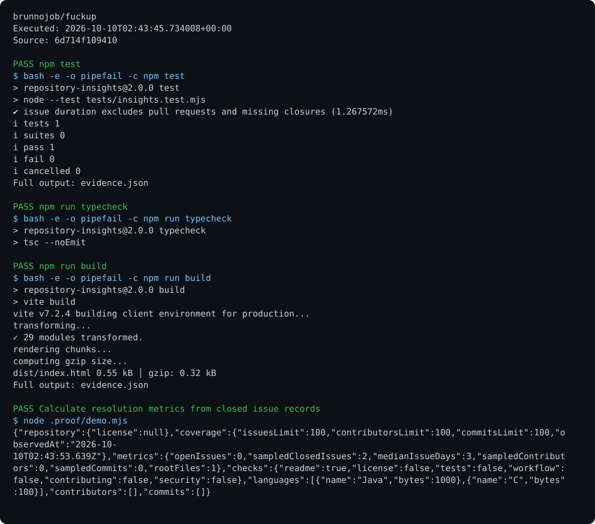

# Repository Insights

Analysis of public GitHub repositories, including languages, contributors, commits, issue duration, and observable structural criteria.

## Run

Requirements: React, TypeScript, Vercel Functions, and Supabase.

```sh
npm ci
npm test
npm run typecheck
npm run build
npm run dev
```

## Behavior

Set `SUPABASE_URL` and `SUPABASE_PUBLISHABLE_KEY`. Reports are stored in `bd_runs` under the authenticated account. Queries inspect up to 100 records per collection and are subject to GitHub's public rate limits. Root-level criteria do not establish the quality of all source code; the application does not promise follower or star increases.

## Optional report archive

Use the [shared operations archive client](https://github.com/brunnojob/vercel-home-telemetry-api/tree/main/cloud) to queue `result.json` under project `fuckup`. The client uses `BRUNNODEV_ACCESS_TOKEN` and retains unacknowledged reports locally.

## License

Original source and documentation are MIT licensed; see [LICENSE](LICENSE). Third-party dependencies and media retain their respective terms. Maintained by [Brunno Dev](https://brunnodev.store).

## Implementation update

`netlify.toml` builds the Vite interface and bundles compatible API functions. The HTTP adapter preserves statuses and headers, rejects repeated query parameters, and bounds JSON request bodies. Run `node --test tests/netlify.test.mjs`. Set Supabase URL and publishable key in the deployment environment before deploying.

Contribution trailer: `Co-authored-by: nyctophile <329826984+ineedfoundmyway@users.noreply.github.com>`.

## Execution proof

[](https://github.com/brunnojob/fuckup/actions/workflows/proof.yml)



[Verified run](https://github.com/brunnojob/fuckup/actions/runs/38018010412) · [Execution report](docs/proof/evidence.json)

Run `python .proof/record.py` after installing the prerequisites above. The scenarios execute repository code and verify exit codes and expected output. CI publishes `execution-proof` with the transcript, input fingerprints and source commit. The downloadable report identifies the exact tested version; the workflow badge tracks the latest run.
